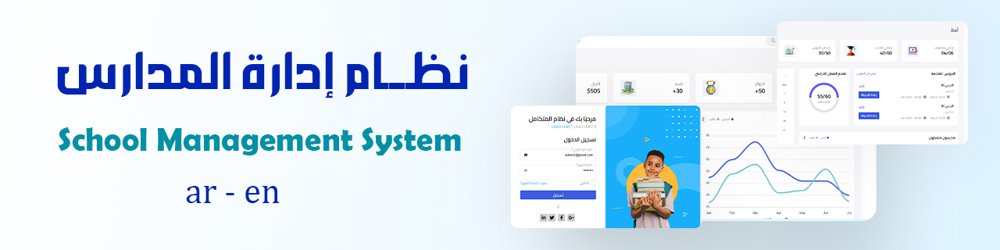
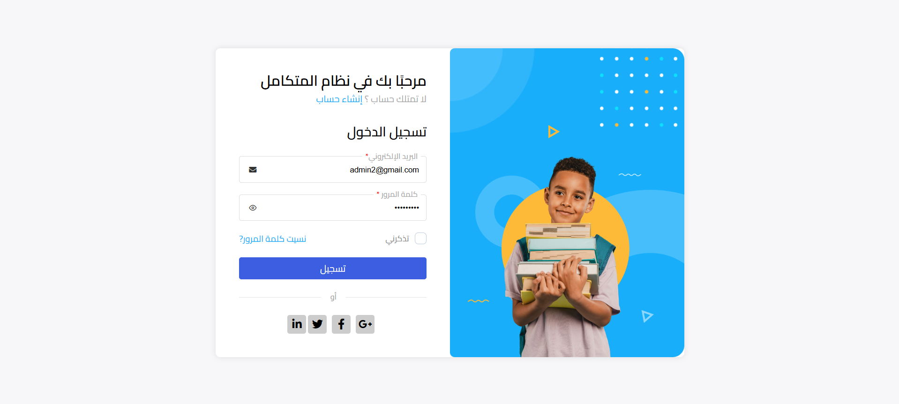
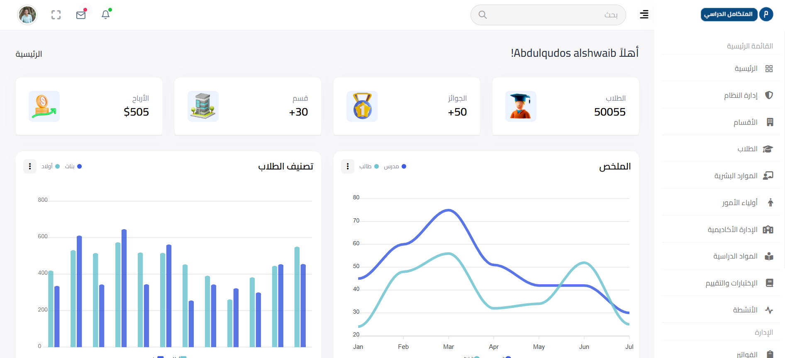
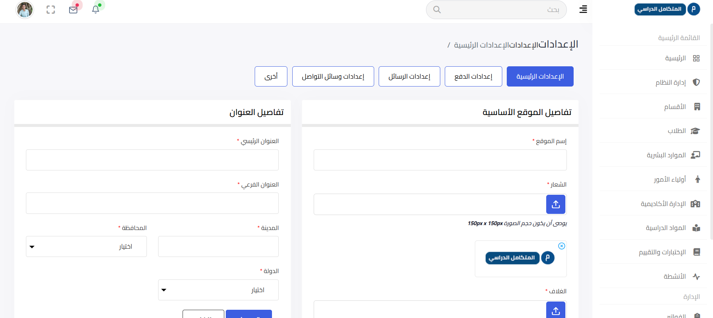
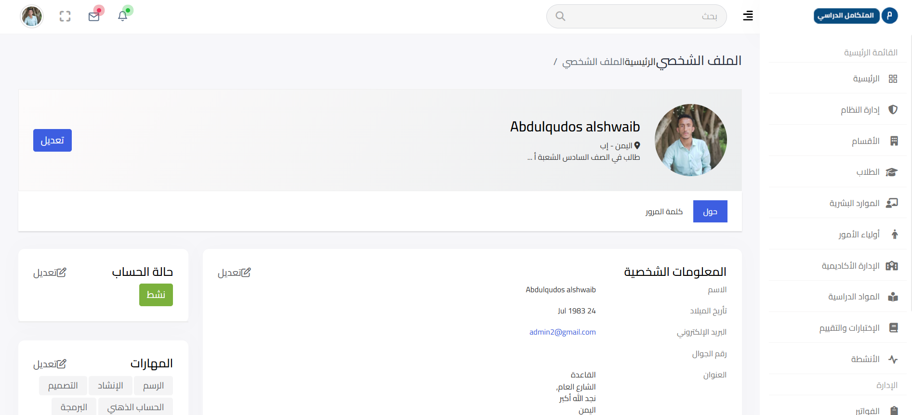
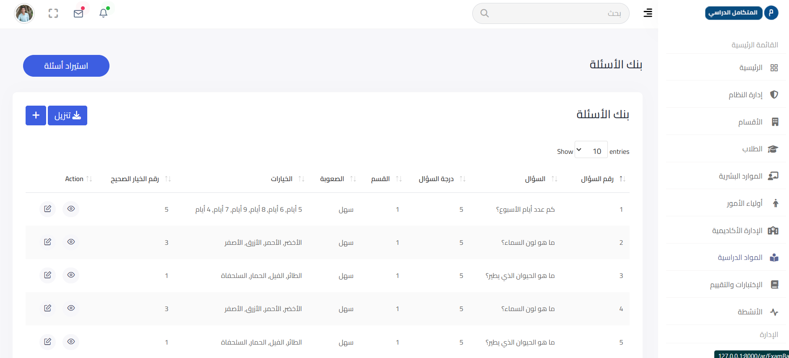
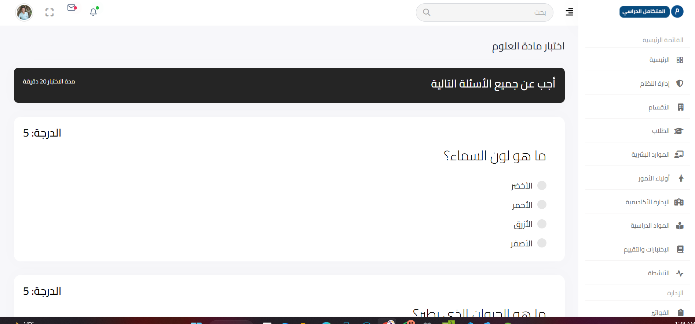
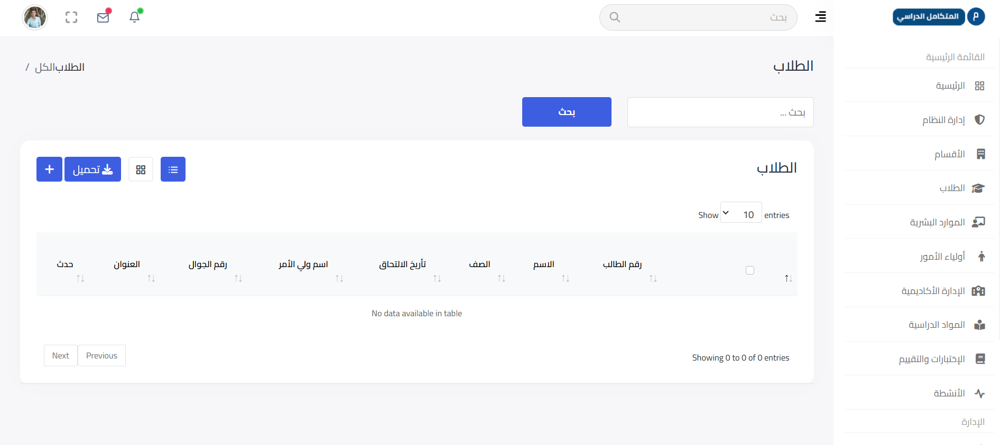
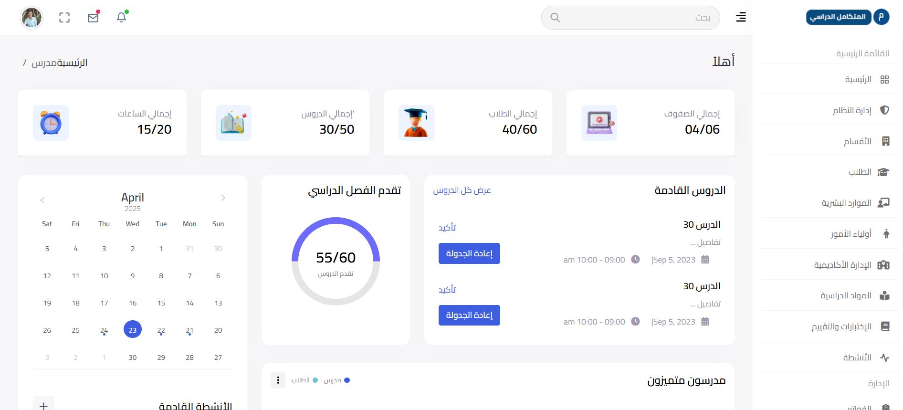

# School Management System (Laravel 9)



A modern, robust School Management System built with **Laravel 9**. This platform streamlines school operations, including student management, academic records, question banks, departments, and more — all via an intuitive, responsive dashboard.

نظام حديث وقوي لإدارة المدارس مبني باستخدام Laravel 9. تعمل هذه المنصة على تسهيل عمليات المدرسة، بما في ذلك إدارة الطلاب، والسجلات الأكاديمية، وبنك الأسئلة، والأقسام، والمزيد — وذلك من خلال لوحة تحكم متجاوبة وسهلة الاستخدام.

---

## Table of Contents

- [Features](#features)
- [Project Structure](#project-structure)
- [Tech Stack](#tech-stack)
- [Contributing](#contributing)

---

## Project Details

This School Management System is a comprehensive platform designed to manage all academic and administrative operations in schools. Below are the main modules and features:

### Main Pages & Modules

- **Login Page (صفحة تسجيل الدخول)**
  - Secure login for admins, teachers, and students.
  - Supports multi-language and right-to-left (RTL) layout.
  - 


- **Dashboard**
  - Centralized overview for quick access to all modules and statistics.
  - 

- **Settings Page (صفحة الإعدادات)**
  - Manage system preferences, language, and notification settings.
  - User can update password, profile info, and application options.
  - 


- **Profile Page (صفحة الملف الشخصي)**
  - View and edit user profile (admin/teacher/student).
  - Upload profile picture, update contact info, and view activity log.
  - 


- **Question Bank (بنك الأسئلة)**
  - Add, edit, import, and organize questions by subject and grade.
  - Supports bulk import (e.g., from Excel files).
  - Ability to generate random exams from the question bank.
  - 

- **Random Exam Generator (إنشاء اختبار عشوائي)**
  - Create randomized tests for students from the question bank.
  - Auto-grading and result display.
  - 

- **Student Management (إدارة الطلاب)**
  - Add, edit, and list students with full profiles.
  - Assign students to classes and sections.
  - Track attendance and grades.
  - 

- **Reports & Analytics (التقارير والإحصائيات)**
  - Generate detailed reports for students, exams, attendance, and more.
  - Visual analytics for school performance.
  - 


- **Other Main Modules:**
  - **Class Schedule (جدول الحصص):** Manage and view weekly class schedules for each grade/class.
  - **Teacher Management (إدارة المدرسين):** Add, edit, and list teachers, assign to classes/subjects.
  - **Departments & Grades (الأقسام والصفوف):** Organize academic structure by departments, grades, and classes.
  - **Subjects Management (إدارة المواد):** Add, edit, and assign subjects to grades/classes.
  - **Sections Management (إدارة الشعب):** Organize students and teachers into sections within each class.
  - **Exam Management (إدارة الامتحانات):** Create, schedule, and manage exams, link to question bank.
  - **User Roles & Permissions (صلاحيات المستخدمين):** Admin, teacher, and student dashboards with role-based access.
  - **Notifications & Alerts (التنبيهات والإشعارات):** Send alerts for exam schedules, attendance, and school events.
  - **Fees & Payments (الرسوم والمدفوعات):** Manage student fees and payment tracking.
  - **Academic Calendar (التقويم الدراسي):** Manage holidays, events, and important school dates.

---

## Features

- 🏫 **Department Management:** Add, edit, and organize school departments.
- 👨‍🎓 **Student Records:** Manage student data, attendance, and grades.
- 📝 **Question Bank:** Create/import questions, generate random exams, auto-grading.
- 📅 **Class Scheduling:** Weekly schedules for classes and teachers.
- 👩‍🏫 **Teacher Management:** Assign teachers to classes/subjects, manage profiles.
- 📚 **Subject Management:** Organize subjects by grade/class.
- 📝 **Exam Management:** Create, schedule, and grade exams.
- 📊 **Reports & Analytics:** Visual reports for all school data.
- 🔒 **Role-Based Access:** Secure authentication for admins, teachers, and students.
- 🌐 **Multi-language Support:** Arabic (RTL) & English (LTR).
- 📱 **Responsive Design:** Works seamlessly on desktop and mobile devices.

---

## Project Structure

```
school_sm_laravel9/
├── app/
│   ├── Http/
│   ├── Models/
│   └── ...
├── public/
│   ├── images/
│   └── ...
├── resources/
│   ├── views/
│   ├── lang/
│   └── ...
├── routes/
│   └── web.php
├── database/
│   └── migrations/
├── .env.example
├── composer.json
└── README.md
```

---

## Tech Stack

- **Framework:** Laravel 9 (PHP)
- **Frontend:** Blade Templates, Bootstrap 5, jQuery
- **Database:** MySQL
- **Authentication:** Laravel Breeze 
- **Other Tools:** DataTables, FontAwesome, SweetAlert
- **Languages:** Arabic (RTL), English (LTR)

---

## Contributing

Pull requests are welcome! For major changes, please open an issue first to discuss what you would like to change.

---


## Contact

For inquiries, contact [alshwaib1@outlook.com](mailto:alshwaib1@outlook.com).

